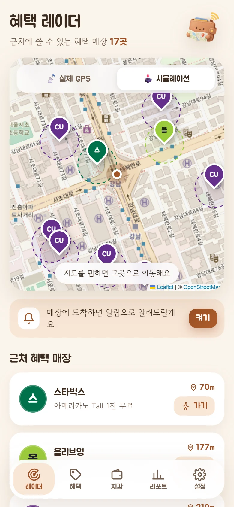
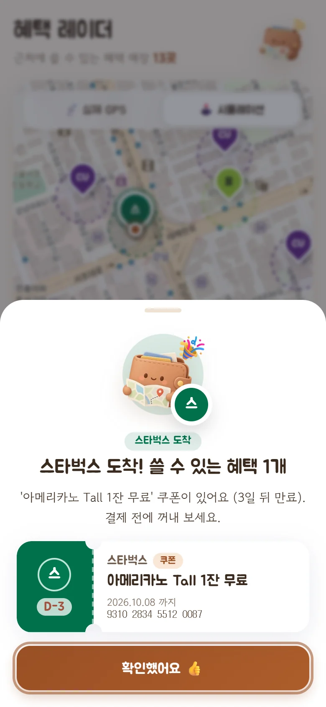
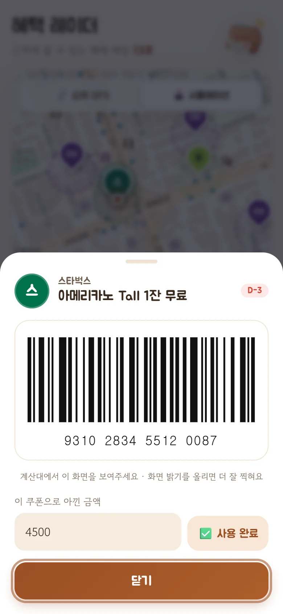
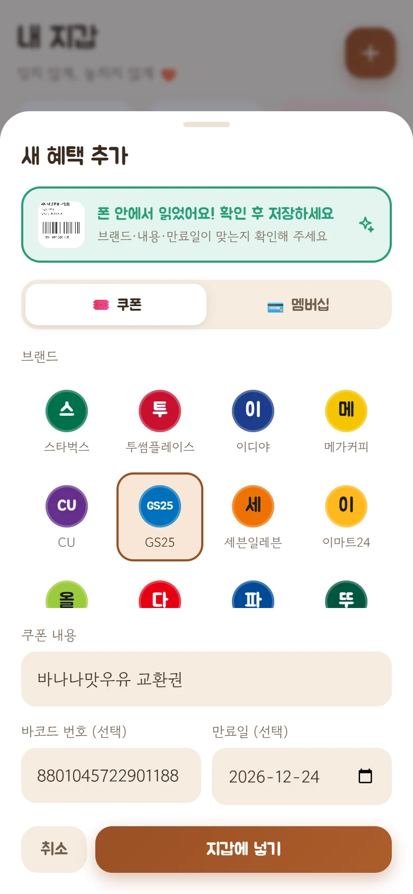
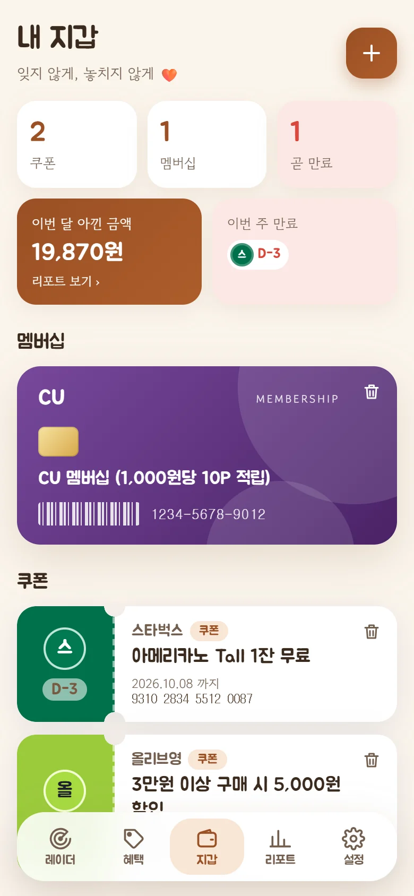
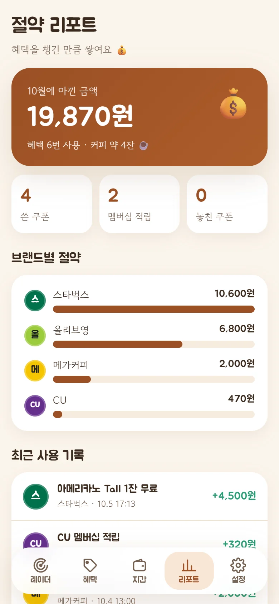
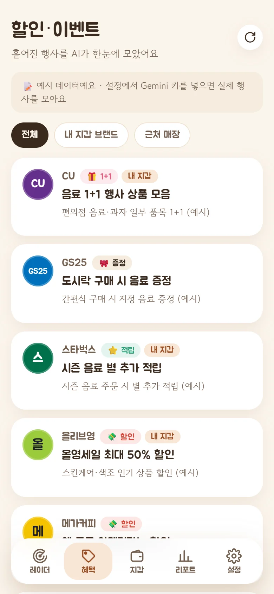
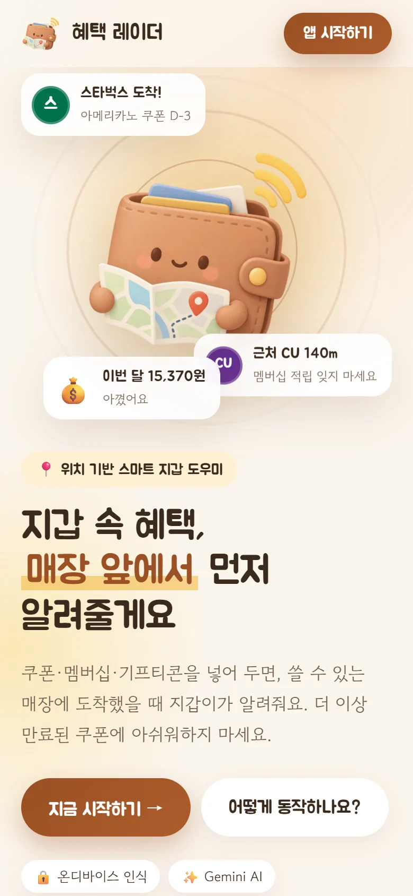
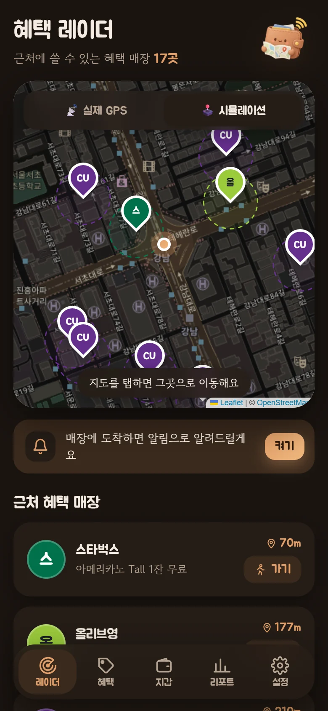
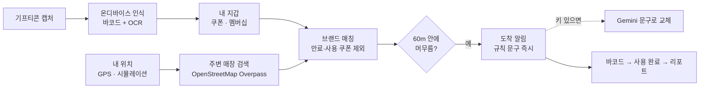

<div align="center">


# 혜택 레이더

**지갑 속 멤버십·쿠폰·기프티콘을, 쓸 수 있는 매장 앞에서 먼저 알려주는 스마트 지갑 도우미**

[**▶ 데모 열기**](https://ckalswl26.github.io/benefit-radar/) · [기획서](docs/기획서_혜택레이더.md) · [릴리스](https://github.com/ckalswl26/benefit-radar/releases)

2026 AI 활용 아이디어 공모전 출품 데모 · 웹앱(PWA)

</div>

---

## 한눈에 보기

| 문제 | 해결 |
|---|---|
| 선물받은 기프티콘을 매장 앞을 지나면서도 잊어버리고, 결국 만료돼요. | 쿠폰을 넣어 두면 **쓸 수 있는 매장에 머무를 때** 알려줘요. |
| 계산이 끝나고 나서야 멤버십 적립이 떠올라요. | 알림을 누르면 **계산대용 바코드**가 바로 떠요. |
| 쿠폰 등록이 귀찮고, 브랜드마다 흩어진 할인 정보는 챙기기 어려워요. | **캡처 한 장**으로 등록하고, 행사 정보는 **AI가 한곳에** 모아요. |

## 바로 체험하기

<table>
<tr>
<td width="200" align="center"><br/><sub>폰 카메라로 스캔</sub></td>
<td>

1. 폰의 **Chrome**으로 [ckalswl26.github.io/benefit-radar](https://ckalswl26.github.io/benefit-radar/) 열기
2. **지금 시작하기** → 레이더 화면 위쪽에서 **🕹️ 시뮬레이션** 선택 (걷지 않고 체험)
3. 근처 매장 카드의 **🚶 가기**를 누르면 내 위치가 매장으로 이동하고, 몇 초 뒤 **도착 알림**이 떠요
4. 메뉴(⋮) → **홈 화면에 추가**하면 앱처럼 쓸 수 있어요

> 처음 열면 시연용 샘플 쿠폰(스타벅스·올리브영)과 멤버십(CU)이 들어 있어요. 설정 → **샘플로 초기화**로 언제든 되돌릴 수 있어요.

</td>
</tr>
</table>

## 이렇게 동작해요

시뮬레이션 모드(강남역)에서 실제 배포 사이트를 캡처한 화면이에요. 화면이 매번 같도록 주변 매장 데이터만 캡처 시점의 검색 결과로 고정했어요.

<table>
<tr>
<td align="center" width="33%"></td>
<td align="center" width="33%"></td>
<td align="center" width="33%"></td>
</tr>
<tr>
<td><b>① 레이더</b><br/>반경 600m 안에서 내 혜택을 쓸 수 있는 매장을 지도와 목록으로 보여줘요. 점선 원은 "도착"으로 판단하는 반경(60m)이에요.</td>
<td><b>② 도착 알림</b><br/>매장 반경 안에 머무르면 쓸 수 있는 혜택을 알려줘요. 만료가 가까운 쿠폰을 먼저 권하고, Gemini 키가 있으면 AI가 문구를 다듬어요.</td>
<td><b>③ 바코드 · 사용 완료</b><br/>쿠폰을 누르면 계산대에서 찍는 바코드가 크게 떠요. 아낀 금액을 넣고 사용 완료하면 리포트에 쌓여요.</td>
</tr>
<tr>
<td align="center"></td>
<td align="center"></td>
<td align="center"></td>
</tr>
<tr>
<td><b>④ 캡처로 등록</b><br/>기프티콘 캡처를 올리면 <b>폰 안에서</b> 바코드와 글자를 읽어 브랜드·상품·만료일을 채워요. 이미지는 밖으로 나가지 않아요.</td>
<td><b>⑤ 내 지갑</b><br/>멤버십은 카드, 쿠폰은 티켓 모양으로 정리돼요. 이번 달 아낀 금액과 이번 주 만료 쿠폰을 위에서 바로 확인해요.</td>
<td><b>⑥ 절약 리포트</b><br/>이번 달 아낀 금액, 브랜드별 절약, 놓친 쿠폰, 사용 기록을 한눈에 보여줘요.</td>
</tr>
<tr>
<td align="center"></td>
<td align="center"></td>
<td align="center"></td>
</tr>
<tr>
<td><b>⑦ 할인·이벤트</b><br/>Gemini가 Google 검색으로 내 브랜드와 근처 매장의 행사를 출처와 함께 모아요. 키가 없으면 <i>예시 데이터</i>로 표시돼요(화면은 예시).</td>
<td><b>⑧ 소개 화면</b><br/>처음 방문하면 서비스 소개가 나오고, 시작하기를 누르면 앱으로 들어가요.</td>
<td><b>⑨ 다크 모드</b><br/>폰 설정에 맞춰 자동으로 바뀌어요.</td>
</tr>
</table>

## 주요 기능

| 기능 | 설명 |
|---|---|
| 📍 위치 기반 도착 알림 | 실제 GPS 또는 시뮬레이션. 매장 60m 안에 머물 때만 알림 (GPS는 15초 정지, 지나가는 길은 거름). 같은 매장은 30분간 다시 알리지 않음 |
| 🔒 온디바이스 캡처 등록 | 브라우저 바코드 인식(없으면 ZXing) + Tesseract.js 한국어 OCR + 규칙 기반 추출. 설정에서 Gemini 인식으로 바꿀 수 있음 |
| ✨ AI 맞춤 안내 | Gemini가 보유 혜택만으로 "무엇을 먼저 꺼낼지" 안내 문구 생성. 실패하면 규칙 기반 문구 |
| 🛍️ 할인·이벤트 모아보기 | Gemini + Google 검색 그라운딩, 출처 링크와 Google 검색 제안 표시, 6시간 캐시 |
| 🧾 바코드 보기 | CODE128 바코드 전체 화면, 화면 꺼짐 방지(Wake Lock) |
| 📊 절약 리포트 | 사용 완료 기록 → 월별 절약액, 브랜드별 그래프, 놓친 쿠폰, 이번 주 만료 브리핑 |

## 어떻게 만들었나



- **스택**: React 19 · TypeScript · Vite, Leaflet(지도), jsbarcode, Tesseract.js, ZXing
- **데이터**: 서버 없이 브라우저 localStorage에 저장. 매장 검색과 Gemini 호출도 브라우저에서 직접
- **배포**: GitHub Actions → GitHub Pages (`main`에 push하면 자동 배포)
- **품질 관리**: 기능 단위로 나눠 구현하고, 단계마다 별도 평가 에이전트가 코드 리뷰(위험/보통/통과) 후 통과 시 다음 단계 진행

## 개인정보

쿠폰·사용 기록은 **이 기기 브라우저에만** 저장돼요. 이 서비스는 계정도, 자체 서버도 없어요. 다만 기능에 따라 아래 정보가 외부 서비스로 전송돼요.

| 기능 | 보내는 곳 | 보내는 정보 |
|---|---|---|
| 주변 매장 검색 | OpenStreetMap Overpass | 검색 중심 좌표(현재 위치), 내 브랜드 키워드 |
| 지도 표시 | OpenStreetMap 타일 서버 | 보고 있는 지도 영역(대략적인 위치) |
| AI 안내 문구 (키 입력 시) | Google Gemini | 도착한 매장명, 보유 혜택 목록 |
| 할인·이벤트 (키 입력 시) | Google Gemini + 검색 | 내 지갑·인기 브랜드 이름 |
| 캡처 인식 – Gemini 모드 (선택 시) | Google Gemini | 캡처 이미지(바코드 포함) |
| 글꼴 · 인식 모델 내려받기 | Google Fonts, jsDelivr CDN | 일반적인 웹 요청 정보(IP 등). 이미지·쿠폰 정보는 보내지 않음 |

- **도착 판정은 기기 안에서만** 하고 위치 기록은 저장하지 않아요.
- 캡처 인식 기본값은 **온디바이스**라 이미지가 기기 밖으로 나가지 않아요. 처음 한 번 인식 모델만 내려받아요.
- Gemini 키는 사용자가 직접 입력하고 해당 기기에만 저장돼요. 코드에 키가 들어 있지 않아요.

## 로컬에서 실행

```bash
pnpm install
pnpm dev          # http://localhost:5173
pnpm build        # dist/ 정적 파일
```

같은 Wi-Fi의 폰에서 개발 서버를 보려면 `pnpm phone`(자체 서명 HTTPS)을 쓰세요. 이 방식은 GPS만 동작하고, 시스템 알림·홈 화면 설치는 배포 주소에서만 돼요.

## 한계와 다음 단계

| 지금(웹앱) | 다음 단계 |
|---|---|
| 앱 화면이 켜져 있을 때만 위치 확인 | 안드로이드 앱(Capacitor) + Geofencing API로 **화면이 꺼져 있어도** 알림 |
| 매장 데이터는 OpenStreetMap 기준이라 누락 가능 | 지도 API·제휴 매장 데이터 연동 |
| 지갑 앱과 연동하지 않는 독립 데모 | 모바일 지갑 파트너 API·딥링크 연동, 위치기반서비스사업자 신고 |
| 생성형 AI 문구는 클라우드(Gemini) | 지원 기기에서 온디바이스 모델(Gemini Nano)로 전환 |

<sub>특정 카드사·간편결제·지갑 서비스와 무관한 독립 데모이며, 샘플·예시 데이터가 포함되어 있어요. 지도 © OpenStreetMap contributors.</sub>
